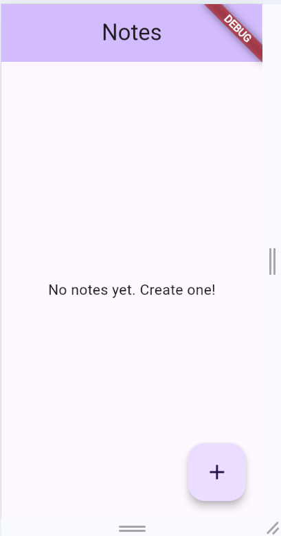
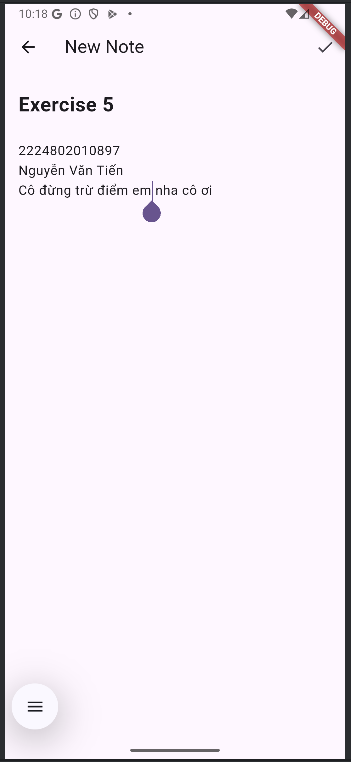
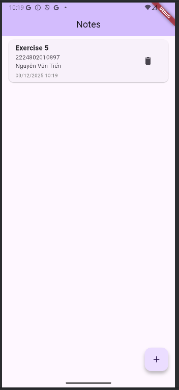
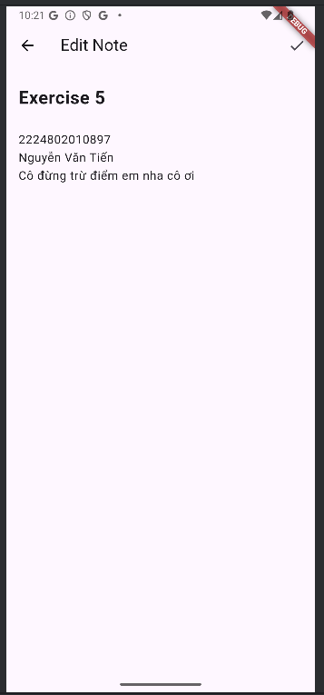

# exercise_week_5
# Ứng dụng Ghi chú Đơn giản - Bài tập Tuần 5

Đây là một ứng dụng ghi chú em code bằng Flutter. Ứng dụng cho phép người dùng tạo, đọc, cập nhật và xóa ghi chú với hỗ trợ lưu trữ trong máy ạ.

**Thông tin sinh viên:**
* **Tên:** Nguyễn Văn Tiến
* **Mã số sinh viên:** 2224802010897
* **Lớp:** CNTT.CQ.T102_ D22KTPM02

## Tech Stack
* **Ngôn ngữ:** Dart
* **Framework:** Flutter
* **Quản lý trạng thái:** Provider
* **Database:** SQLite (sqflite)

## Tính năng
* **Danh sách Ghi chú:** Xem tất cả ghi chú được sắp xếp theo thời gian cập nhật mới nhất.
* **Tạo Ghi chú:** Thêm ghi chú mới với tiêu đề và nội dung.
* **Chỉnh sửa Ghi chú:** Sửa đổi ghi chú hiện có.
* **Xóa Ghi chú:** Xóa ghi chú không mong muốn khỏi cơ sở dữ liệu.
* **Tính bền vững:** Dữ liệu được lưu cục bộ bằng SQLite, do đó các ghi chú vẫn được lưu sau khi khởi động lại ứng dụng.

## Ảnh chụp màn hình

### 1. Màn hình chính (Danh sách ghi chú)


### 2. Tạo ghi chú mới


### 3. thêm thành công ghi chú mới

### 4. Chỉnh sửa ghi chú hiện có

## Cách chạy

1. **tải dự án về bằng cách này nè:**
```bash
git clone https://github.com/conbobi/exercise_week_5
```

2. **Cài đặt các phụ thuộc:**
```bash
flutter pub get
```

3. **Chạy ứng dụng:**
```bash
flutter run
```